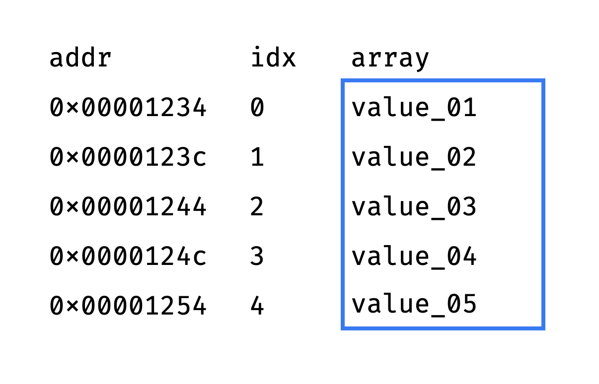

# Data Structures in Python
[https://realpython.com/python-data-structures/](https://realpython.com/python-data-structures/)

**Typical base data types, such as integers or floating-point values, \
that are available in most computer programming languages are generally insufficient \
to capture the logical intent for data processing and use. \
Yet applications that ingest, manipulate and produce information \
must understand how data should be organized to simplify processing. \
Data structures bring together the data elements in a logical way \
and facilitate the effective use, persistence and sharing of data. \
They provide a formal model that describes the way the data elements are organized.**

**Data structures are the fundamental constructs around which you build your programs. \
Each data structure provides a particular way of organizing data so it can be accessed efficiently, \
depending on your use case. \
Python ships with an extensive set of data structures in its standard library.**


## Array Data Structures

**An array is a fundamental data structure available in most programming languages, \
and it has a wide range of uses across different algorithms.**


**Arrays consist of fixed-size data records that allow each element to be efficiently located based on its index: \
Because arrays store information in adjoining blocks of memory, they’re considered contiguous data structures \
(as opposed to linked data structures like linked lists, for example).**

**This is how we define a list literal**

```python
l = [1, 2, 3, 4, 5]
```

**Unlike strings and other structures, lists are mutable. \
We can add new elements to them, we can change the elements in a certain index.**

```python
l = [1, 2, 3, 4, 5]
l.append(1)
l[-1] = 6
```


**Performance-wise, it’s very fast to look up an element contained in an array given the element’s index.**

```python
l = [1, 2, 3, 4, 5]
print(l[0])
```

**Let's take a deeper dive and see how lists are actually implemented and see where their strengths are.**

[https://antonz.org/list-internals/](https://antonz.org/list-internals/)

## list == array?

**The list is based on an array. An array is a set of elements ① of the same size, ② located in memory \
one after another, without gaps.**

**Since elements are the same size and placed contiguously, it is easy to get an array item by index. \
All we need is the memory address of the very first element (the "head" of the array).**

**Let's say the head is located at the address 0×00001234, and each item occupies 8 bytes. \
Then the element with the idx index is located at 0×00001234 + idx*8:**



**Since the "get value by address" memory operation takes constant time, \
selecting an array item by index also takes O(1).**

**Roughly speaking, this is how Python list works. \
It stores a pointer to the head of the array and the number of items in the array. \
The item count is stored separately so that the `len()` function also performs in O(1) time, \
and does not have to count the elements each time.**

**So far so good. But there are a couple of problems: \
All array elements are the same size, but the list should be able to store items of different sizes \
(true/false, numbers, strings of different lengths). \
The array has a fixed length, but the list should be able to store an arbitrary number of items.**

## list = Array of Pointers

**The list instantly retrieves an item by index, because it has an array inside. \
And the array is so fast because all the elements are the same size. \
But list items can be of different sizes:**

```python
guests = ["Frank", "Claire", "Zoe", True, 42]
```

**To solve this problem, someone came up with the idea of storing item pointers instead of item values. \
Each element of the array is a memory address, and if you follow this address — you will get the actual value.
The array stores pointers adjacently. But the values they refer to can be stored anywhere in memory.**

**To make the long story short: \
A list is a data structure that internally uses an array \
which has pointers (memory addresses) to the actual values you've defined, and the values \
themselves are stored at some random location in memory. This is the reason why we have \
constant element access time, while being able to include values of different types.**


## What operations work fast with lists?

> **_NOTE:_** Lists perform best for the following operations: \
> selecting a item by index - `lst[index]` \
> counting items - `len(lst)` \
> add an item to the end of the list - `lst.append(item)` \
> remove an item from the end of the list - `lst.pop()`


> **_NOTE:_** Lists perform poorly for the following operations: \
> Insert an item by index - `lst.insert(idx, item)` \
> Delete an item by index - `lst.pop(idx)` \
> Search an item by value
```python
for item in lst:
    if item == "some_value_we_are_searching_for":
        do_something_with_item()
```
> Remove an item by value
```python
for item in lst:
    if item == "some_value_we_are_searching_for":
        lst.remove(item)
```
> Select a slice of `n` elements - `lst[from:to]`


## List characteristics

- Lists are ordered (some structures in Python are not ordered, as you will see)

```python
a = [1, 2, 3, 4, 5]
b = [1, 2, 3, 4, 5]
print(a == b)

a = [1, 2, 3, 4, 5]
b = [5, 4, 3, 2, 1]
print(a == b)
```

- Lists can contain arbitrary object types

```python
a = [1, 2, 3, 4, 5]
b = ["one", "two", "three"]
c = [True, 5.123, 1, False, "this is a string"]
```

- List elements can be accessed by index

```python
a = [1, 2, 3, 4, 5]
print(a[1])
print(a[-1])
```


- Lists can be nested

```python
a = [[1, 2, 3], [4, 5, 6], [7, 8, 9]]
```

- Lists are mutable

```python
a = [1, 2, 3, 4, 5]
a[-1] = 6
print(a)

a[0:2] = [7, 8, 9]
print(a)
```

- Prepending or appending items to a list


```python
a = ["one", "too", "three"]
a.append("four")
a.insert(0, "zero")
print(a)
```

- You can merge lists together

**Here are two ways you can do that:**

```python
a = [1, 2, 3, 4]
b = [5, 6, 7, 8]
c = a + b
print(c)
```

```python
a = [1, 2, 3, 4]
b = [5, 6, 7, 8]
a.extend(b)
print(a)
```
> **_NOTE:_** List methods change the original object because list by nature \
> are mutable structures, so it wouldn't make much sense to return new objects \
> every time you mutate the list. The same rule applies to other mutable structures as well.

- Lists are iterable


```python
l = [1, 2, 3, 4, 5]
for item in l:
    print(item)
```

**But since lists made to be accessed by index, it's worth showing how we would iterate the list by \
calling the indexes**

```python
l = [1, 2, 3, 4, 5]
for i in range(len(l)):
    print(l[i])
```

**Let's try something a little bit trickier. Let's say that we want to increment each list element by 2:**

```python
l = [1, 2, 3, 4, 5]
for i in range(len(l)):
    l[i] += 2
```


**Let's increase the complexity a little bit more. This time we want to increment only the items where \
the index is even**

```python
l = [1, 2, 3, 4, 5]
for i in range(len(l)):
    if i % 2 == 0:
        l[i] += 2
```

- Lists can be sorted

**Let's say we have a list of integers and we want to find the second-largest element**

```python
l = [3, 7, 1, 2, 5, 4, 6]
l.sort()
print(l[1])
```

**Now let's say that some elements are repeated and still want to find the \
second-largest element (we could do that by using a `set` but for now we only know lists)**

```python
l = [3, 3, 5, 1, 7, 1, 2, 5, 4, 6]
l.sort()

last_largest_seen = l[0]
for i in range(len(l)):
    if l[i] > last_largest_seen:
        print(l[i])
        break
```

**How about if we want the third-largest element? \
This time we will need to take a different approach, because we can't just print the \
first larger element that we see. We are going to need to keep track of all the unique elements that we've \
come across until the amount of unique elements becomes the n-th largest element we're looking for.**


```python
l = [3, 3, 5, 1, 7, 1, 2, 5, 4, 6]
l.sort() # We need to make sure the items are sorted

last_unique_items = [0]
for item in l:
    if item > last_unique_items[-1]:
        last_unique_items.append(item)
    if len(last_unique_items) == 4:
        print(last_unique_items[-1])
        break
```
